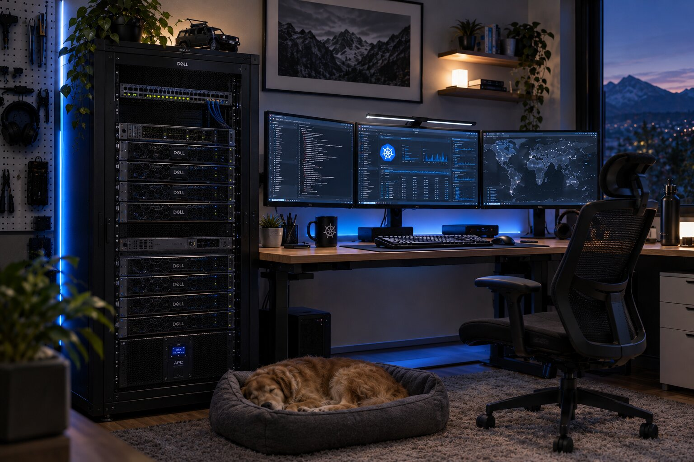
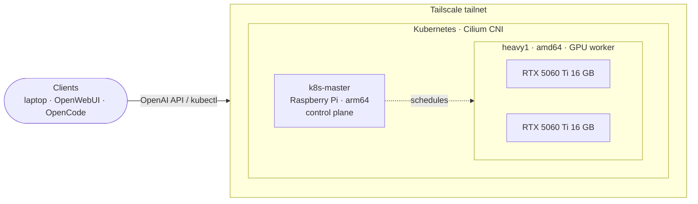

<h1 align="center">homelab</h1>

<p align="center">
  
</p>

<p align="center">
  
  
  
  
  
  
</p>

<p align="center">
  Infrastructure-as-code for a self-hosted Kubernetes lab: GPU inference, networking and platform tooling.<br>
  Everything I run, test and break at home lives here.
</p>

---

## Overview

This repository is the single source of truth for my homelab. It is a small hybrid-architecture cluster (an arm64 control plane and an amd64 GPU worker) that I use to run day-to-day services and to try out cloud-native and AI-infrastructure tools before I'd trust them anywhere else.

All workloads are declarative and versioned: plain manifests composed with Kustomize, with images and upstream dependencies pinned to exact versions, and each design decision documented next to the code it explains.

## Architecture



| Node | Role | Hardware |
|---|---|---|
| `k8s-master` | Control plane | Raspberry Pi (arm64) |
| `heavy1` | Worker, GPU node (`nvidia.com/gpu` taint) | AMD Ryzen 5 5600G · 64 GB RAM · 2× NVIDIA RTX 5060 Ti 16 GB |

## Projects

| Area | Description | Stack | Status |
|---|---|---|---|
| [GPU platform](k8s/nvidia-operator/) | GPU scheduling on Kubernetes using the host driver, with a `RuntimeClass` and device plugin | NVIDIA GPU Operator, Helm | ✅ Running |
| [LLM serving](k8s/vllm/qwen38-27b-single/) | A 27B coding model split across two consumer GPUs with tensor parallelism | vLLM, NVFP4, MTP speculative decoding | ✅ Running |
| [Cache-aware inference routing](k8s/vllm/qwen-llmd/) | Multi-replica serving with prefix-cache-aware load balancing, set up for A/B testing against round-robin | llm-d, Envoy `ext_proc`, Gateway API Inference Extension | 🧪 Experiment |
| DNS & ad blocking | Network-wide DNS filtering | Pi-hole | 📋 Planned |
| GitOps | Continuous reconciliation of this repository into the cluster | Argo CD | 📋 Planned |
| Observability | Metrics and dashboards for the cluster and inference (TTFT, cache hit rate, queues) | Prometheus, Grafana | 📋 Planned |

### Highlights

- **GPU scheduling**: node taints and tolerations, `runtimeClassName`, exclusive GPU allocation, and a `Recreate` strategy so two pods never compete for the same cards.
- **Capacity planning**: VRAM budgets worked out per replica (weights, CUDA graphs, FP8 KV cache) and documented in the manifests.
- **Inference routing**: an llm-d Endpoint Picker that keeps each conversation on the replica holding its KV cache, plus a calibration Job that measures this hardware so the routing parameters do not rely on upstream defaults measured on H100s.
- **Safe operations**: CRDs and namespaces kept out of disposable kustomizations, so `kubectl delete -k` can't take down shared resources. Config changes trigger rollouts through hashed ConfigMaps.

## Repository layout

```
.
└── k8s/
    ├── nvidia-operator/          GPU Operator installation
    └── vllm/
        ├── qwen38-27b-single/    single 27B model, TP=2 across both GPUs
        └── qwen-llmd/
            ├── model/            2× Qwen3-8B replicas, one per GPU
            └── llmd/             llm-d router, CRDs, calibration job, docs
```

Each project is self-contained, with its own `kustomization.yaml` (or install script) and, where useful, a README covering its design and runbook.

## Usage

```bash
# Render and review before applying
kubectl kustomize k8s/vllm/qwen38-27b-single/deploy

# Apply
kubectl apply -k k8s/vllm/qwen38-27b-single/deploy
```

## Roadmap

- [x] Kubernetes cluster over Tailscale with Cilium
- [x] NVIDIA GPU Operator
- [x] vLLM serving on consumer Blackwell GPUs
- [x] llm-d cache-aware router (standalone mode)
- [ ] Load test: llm-d vs round-robin (TTFT p50/p95, prefix-cache hit rate)
- [ ] Prometheus + Grafana
- [ ] Argo CD (GitOps for this repository)
- [ ] Pi-hole
